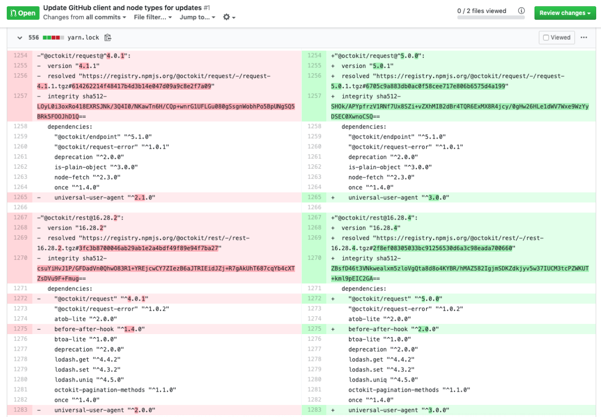

# Lockfile tampering

The beauty of the open source world is that anybody can contribute, adding new features and improvemnts. But this also comes with several risks, making open source projects a target of supply chain attacks. Lockfile tampering is a supply chain attack where the attacker tries to inject a malicious dependency into a project through tampering the lockfile.


### Why is this the case?
- package managers do not sufficiently verify the integrity of lockfiles
- github interface defaults to floding diffs whenever they are larger than a couple of hundred lines of code in length => many don't carefully review lockfiles
- lockfiles are machine-generated and small modifications are easily missed during code review due to the mass of changes included
- havily usage of third-party packages

### Example


- The packages I introduced are known in the ecosystem and are vulnerabilities free
- There are no typosquatting attempts in these package names
- These are valid versions of those packages and aren’t malicious in and of themselves 



original ms package has been replaced to resolve private ms pacakge
Even though several other dependencies use ms only one dependency uses ms@2.1.1. This makes it very hard to notice since the malicious change won't cause any code breaks and all other package use the orignal ms dependency.

Once the lockfile is merged the supply chain is interfered and malicious software get's deployed every time the CI/CD pipeline runs.

Logic of the ms module can be altered, postinstall scripts can be run, many ways to damage target software.
````
"scripts": {
    "postinstall": "echo im installed && echo hello > /tmp/world.txt",
}
````
Relatively easy to detect that a hosting URL like  https://github.com/lirantal/ms/tarball/master is malicious but what if it would look like this https://registry.npmgs.org/ms/?

Exponential factor => if lockfile of widely used package is tempered this one attack opens the door to millions of other software attacks

### Atackers perspective

### How to prevent lockfile tampering


### References
https://snyk.io/blog/why-npm-lockfiles-can-be-a-security-blindspot-for-injecting-malicious-modules/
https://www.youtube.com/watch?v=UkWJeqb8BZk
